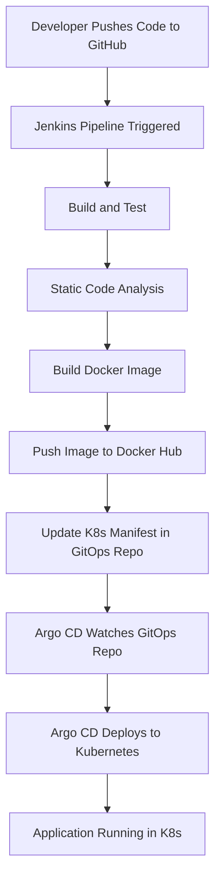

# Java Spring Boot CI/CD GitOps Project

**Source Code Repo:** [java-spring-boot-app](https://github.com/mohansaravanan21/java-spring-boot-app)

**Kubernetes Manifests Repo:** [springboot-app-manifests](https://github.com/mohansaravanan21/springboot-app-manifests)

This project is a sample Java Spring Boot web application demonstrating a complete CI/CD pipeline with GitOps practices. It includes automated build, test, static code analysis, Docker image creation, and deployment to Kubernetes using Argo CD, all orchestrated via Jenkins.


## Features
- Spring Boot web application (Maven-based)
- Jenkins pipeline for CI/CD
- Static code analysis with SonarQube
- Docker image build and push to Docker Hub
- GitOps deployment to Kubernetes using Argo CD
- Automated update of Kubernetes manifests
- GitHub webhook integration for automated pipeline triggers

## Architecture Diagram




## Project Structure
```
├── Dockerfile                # Docker build instructions
├── JenkinsFile               # Jenkins pipeline definition
├── pom.xml                   # Maven project file
├── src/
│   └── main/
│       ├── java/com/abhishek/StartApplication.java  # Main Spring Boot app
│       └── resources/
│           ├── application.properties
│           ├── static/
│           │   ├── css/main.css
│           │   └── js/main.js
│           └── templates/index.html
└── target/                   # Build output (ignored by git)
```

## CI/CD Pipeline Overview
The Jenkins pipeline performs the following stages:
1. **Build and Test**: Compiles the code and runs tests using Maven.
2. **Static Code Analysis**: Runs SonarQube analysis.
3. **Build Docker**: Builds a Docker image for the application.
4. **Push the Artifacts**: Pushes the Docker image to Docker Hub.
5. **Checkout**: Clones the Kubernetes manifests repository.
6. **Update Deployment File**: Updates the deployment manifest with the new image tag and pushes the change.

## Prerequisites
- Docker
- Maven
- Jenkins (with Docker and required plugins)
- SonarQube server
- Docker Hub account
- GitHub repository for manifests
- Argo CD for Kubernetes deployment

## How to Run Locally
1. **Build the project:**
   ```bash
   mvn clean package
   ```
2. **Run the application:**
   ```bash
   mvn spring-boot:run
   ```
3. **Access the app:**
   Open `http://localhost:8080` in your browser.

## How to Build and Deploy with Jenkins
- Configure Jenkins with the required credentials for Docker Hub, SonarQube, and GitHub.
- Set up a webhook in your source repository to trigger the Jenkins pipeline.
- The pipeline will automatically build, test, analyze, build/push Docker image, and update the Kubernetes deployment manifest.


## GitOps with Argo CD
- Argo CD is installed via [OperatorHub.io](https://operatorhub.io/operator/argocd-operator).
- The manifests repository is monitored by Argo CD.
- When the deployment manifest is updated with a new image tag, Argo CD automatically deploys the new version to Kubernetes.

### Install Jenkins.

Pre-Requisites:
 - Java (JDK)

### Run the below commands to install Java and Jenkins

Install Java

```
sudo apt update
sudo apt install openjdk-17-jre
```

Verify Java is Installed

```
java -version
```

Now, you can proceed with installing Jenkins

```
curl -fsSL https://pkg.jenkins.io/debian/jenkins.io-2023.key | sudo tee \
  /usr/share/keyrings/jenkins-keyring.asc > /dev/null
echo deb [signed-by=/usr/share/keyrings/jenkins-keyring.asc] \
  https://pkg.jenkins.io/debian binary/ | sudo tee \
  /etc/apt/sources.list.d/jenkins.list > /dev/null
sudo apt-get update
sudo apt-get install jenkins
```

**Note: ** By default, Jenkins will not be accessible to the external world due to the inbound traffic restriction by AWS. Open port 8080 in the inbound traffic rules as show below.

- EC2 > Instances > Click on <Instance-ID>
- In the bottom tabs -> Click on Security
- Security groups
- Add inbound traffic rules as shown in the image (you can just allow TCP 8080 as well, in my case, I allowed `All traffic`).

## Install the Docker Pipeline plugin in Jenkins:

   - Log in to Jenkins.
   - Go to Manage Jenkins > Manage Plugins.
   - In the Available tab, search for "Docker Pipeline".
   - Select the plugin and click the Install button.
   - Restart Jenkins after the plugin is installed.

## Docker Slave Configuration

Run the below command to Install Docker

```
sudo apt update
sudo apt install docker.io
```
 
### Grant Jenkins user and Ubuntu user permission to docker deamon.

```
sudo su - 
usermod -aG docker jenkins
usermod -aG docker ubuntu
systemctl restart docker
```

Once you are done with the above steps, it is better to restart Jenkins.

```
http://<ec2-instance-public-ip>:8080/restart
```

The docker agent configuration is now successful.


### Configure a Sonar Server locally

```
System Requirements
Java 11 (Oracle JDK, OpenJDK, or AdoptOpenJDK)
Hardware Recommendations:
   Minimum 2 GB RAM
   2 CPU cores
sudo apt update && sudo apt install unzip -y
adduser sonarqube
wget https://binaries.sonarsource.com/Distribution/sonarqube/sonarqube-9.4.0.54424.zip
unzip *
chmod -R 755 /home/sonarqube/sonarqube-9.4.0.54424
chown -R sonarqube:sonarqube /home/sonarqube/sonarqube-9.4.0.54424
cd sonarqube-9.4.0.54424/bin/linux-x86-64
./sonar.sh start

Hurray !! Now you can access the `SonarQube Server` on `http://<ip-address>:9000
```

## License
This project is licensed under the MIT License.
