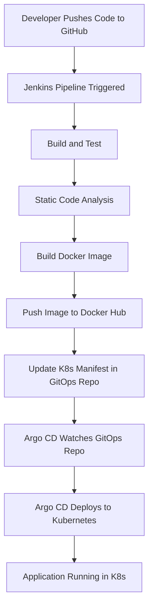

# Java Spring Boot CI/CD GitOps Project

This project is a sample Java Spring Boot web application demonstrating a complete CI/CD pipeline with GitOps practices. It includes automated build, test, static code analysis, Docker image creation, and deployment to Kubernetes using Argo CD, all orchestrated via Jenkins.


## Features
- Spring Boot web application (Maven-based)
- Jenkins pipeline for CI/CD
- Static code analysis with SonarQube
- Docker image build and push to Docker Hub
- GitOps deployment to Kubernetes using Argo CD
- Automated update of Kubernetes manifests
- GitHub webhook integration for automated pipeline triggers

## Architecture Diagram



## Project Structure
```
├── Dockerfile                # Docker build instructions
├── JenkinsFile               # Jenkins pipeline definition
├── pom.xml                   # Maven project file
├── src/
│   └── main/
│       ├── java/com/abhishek/StartApplication.java  # Main Spring Boot app
│       └── resources/
│           ├── application.properties
│           ├── static/
│           │   ├── css/main.css
│           │   └── js/main.js
│           └── templates/index.html
└── target/                   # Build output (ignored by git)
```

## CI/CD Pipeline Overview
The Jenkins pipeline performs the following stages:
1. **Build and Test**: Compiles the code and runs tests using Maven.
2. **Static Code Analysis**: Runs SonarQube analysis.
3. **Build Docker**: Builds a Docker image for the application.
4. **Push the Artifacts**: Pushes the Docker image to Docker Hub.
5. **Checkout**: Clones the Kubernetes manifests repository.
6. **Update Deployment File**: Updates the deployment manifest with the new image tag and pushes the change.

## Prerequisites
- Docker
- Maven
- Jenkins (with Docker and required plugins)
- SonarQube server
- Docker Hub account
- GitHub repository for manifests
- Argo CD for Kubernetes deployment

## How to Run Locally
1. **Build the project:**
   ```bash
   mvn clean package
   ```
2. **Run the application:**
   ```bash
   mvn spring-boot:run
   ```
3. **Access the app:**
   Open `http://localhost:8080` in your browser.

## How to Build and Deploy with Jenkins
- Configure Jenkins with the required credentials for Docker Hub, SonarQube, and GitHub.
- Set up a webhook in your source repository to trigger the Jenkins pipeline.
- The pipeline will automatically build, test, analyze, build/push Docker image, and update the Kubernetes deployment manifest.

## GitOps with Argo CD
- The manifests repository is monitored by Argo CD.
- When the deployment manifest is updated with a new image tag, Argo CD automatically deploys the new version to Kubernetes.

## License
This project is licensed under the MIT License.
